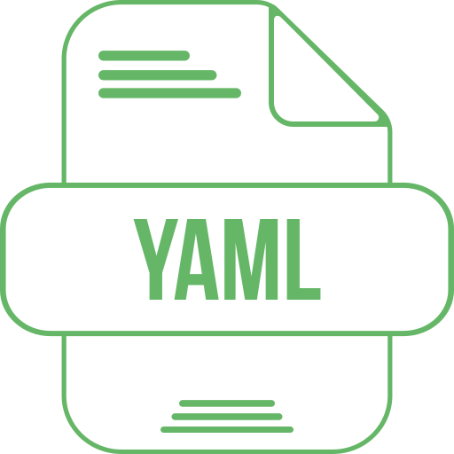

# CONCEPTOS BÁSICOS DE YAML

## ¿QUÉ ES YAML?

YAML es un lenguaje de serialización de datos que las personas pueden comprender y suele utilizarse en el diseño de archivos de configuración. Para algunas personas, YAML significa otro lenguaje de marcado más; para otras, es un acrónimo recursivo que quiere decir "YAML no es un lenguaje de marcado", lo que enfatiza la idea de que se utiliza para los datos, no para los documentos. 



## ¿Para qué sirve YAML?

Uno de los usos más comunes es la creación de archivos de configuración. Se recomienda utilizar YAML en lugar de JSON para escribir los archivos de configuración porque es un lenguaje más fácil de comprender, aunque ambos pueden usarse de manera indistinta en la mayoría de los casos.  

Además de Ansible, hay otros elementos que utilizan YAML, como las implementaciones y los recursos de Kubernetes. 

Una de las ventajas de utilizarlo es que se pueden agregar los archivos a un control de versiones, como Github, para rastrear y auditar los cambios.

## CARACTERÍSTICAS DE YAML

### 1. Legibilidad humana:
YAML utiliza un formato basado en texto plano que es fácil de leer y entender para los humanos. No utiliza caracteres especiales como corchetes o comillas, lo que mejora la legibilidad.
        
### 2. Facilidad de escritura:
La sintaxis de YAML es simple y concisa, lo que facilita la escritura de archivos de configuración o datos. No requiere tantos caracteres como otros formatos de configuración.

### 3. Soporte para datos estructurados:
YAML permite representar datos de forma estructurada mediante la indentación, lo que facilita la organización y comprensión de la información.

### 4. Portabilidad entre lenguajes:
YAML es un formato independiente del lenguaje, lo que significa que puede ser utilizado en una variedad de entornos y es fácil de leer y escribir en diferentes lenguajes de programación.

### 5. Integración con herramientas de automatización:
YAML es comúnmente utilizado en el contexto de herramientas de automatización, como Ansible y Kubernetes, lo que facilita la integración y configuración de sistemas.

## EJEMPLO

```json
# Información del equipo de desarrollo
equipo_desarrollo:
  - nombre: Juan Perez
    rol: desarrollador
    edad: 30
    lenguajes:
      - Python
      - JavaScript

  - nombre: María González
    rol: diseñadora
    edad: 28
    herramientas:
      - Adobe Illustrator
      - Figma

  - nombre: Carlos Rodríguez
    rol: tester
    edad: 32
    habilidades:
      - Pruebas de regresión
      - Automatización de pruebas

```

## BIBLIOGRAFÍA
1. [RED HAT](https://www.redhat.com/es/topics/automation/what-is-yaml)
